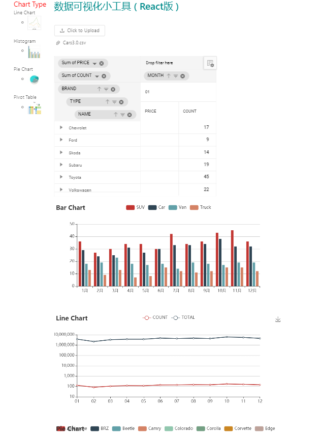

# 步骤一：运行后端程序
    1,进入server.py
    2,使用python运行server.py
    注：代码运行依赖与python，flask，numpy, pandas

# 步骤二：运行前端页面
    1, cnpm install
    2, npm run dev
    3, 自动跳转至页面
    4, 上传的文件为：Cars3.0.csv
    5, 按步骤操作
    
# 效果展示

